# 📚 Smart Library — ESP32-S3

<p align="center">
  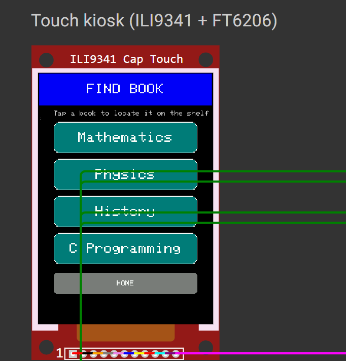
</p>

<h1 align="center">⚡ Smart Library</h1>

<p align="center">
  <b>A completed Smart Library prototype built around a single ESP32-S3 board.</b>
</p>

<p align="center">
  🔎 Find Books &nbsp;•&nbsp; 📡 Identify Books &nbsp;•&nbsp; 📖 Issue &nbsp;•&nbsp; ↩️ Return &nbsp;•&nbsp; 🚨 Security
</p>

<p align="center">
  
  
  
  
</p>

---

## 🌟 1. What is Smart Library?

Finding a book is not always as simple as knowing that it is **available**.

A student may know:

```text
📚 Book: Available
```

but still have to ask:

```text
❓ Which shelf?
❓ Which section?
❓ Which row?
❓ How do I issue it?
❓ How do I return it?
```

Our project explores a simple idea:

> **Can one ESP32-S3 turn the library into an interactive, guided experience?**

The result is a completed prototype that combines **book discovery, physical identification, issue/return interaction, visual indication and security-oriented feedback** around a single ESP32-S3 board.

---

# 💡 2. From Inspiration to Our Own Idea

The project was inspired by the **smart-library problem described in a reference article/document**. The reference concept discusses book-location difficulties, RFID-based transactions, shelf guidance and security. fileciteturn1file0L15-L26

The reference architecture is broader and uses multiple controllers and subsystems. fileciteturn1file0L5-L12

Instead of reproducing that architecture, we asked:

### 🧠 “What if we rethink the experience around ONE ESP32-S3?”

That became our engineering direction.


### Our design principle

> **Take the problem → rethink the architecture → build a compact working solution.**

---

# 🧭 3. How the Whole System Works

Think of the ESP32-S3 as the **brain of the library kiosk**.

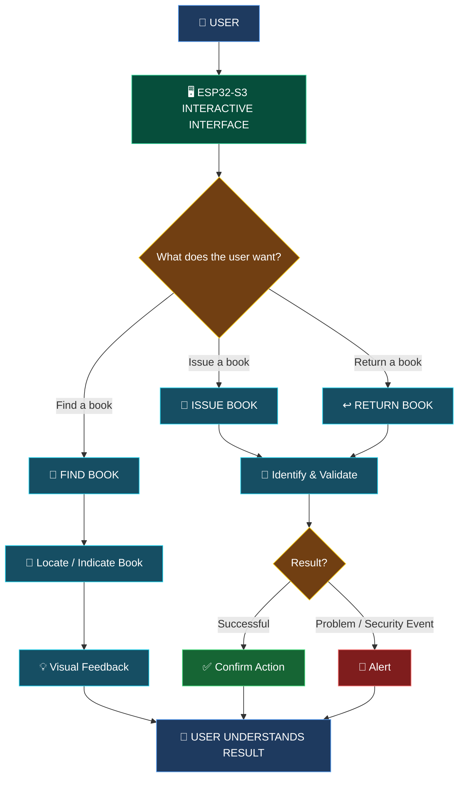

### In simple words

**1. User interacts with the system**  
The user starts from the ESP32-S3 interface.

**2. ESP32-S3 decides what operation is required**  
Find, Issue or Return.

**3. The required hardware interaction happens**  
For example, RFID can be used when physical identification is required.

**4. The ESP32-S3 processes the result**  
The system determines what should happen next.

**5. The user gets immediate feedback**  
The display, LEDs or alert mechanism communicates the result.

---

# 🧠 4. The ESP32-S3 is the Central Brain

Instead of thinking about the project as many independent circuits, think of it like this:

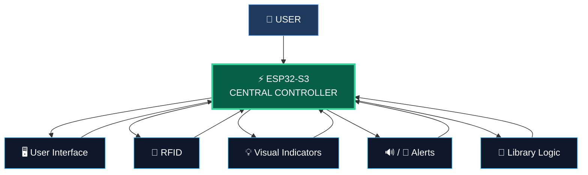

### Why this approach?

| Traditional approach | Our approach |
|---|---|
| Several controller boards | **One ESP32-S3 core** |
| Distributed logic | **Centralized control** |
| More inter-board communication | **Simpler central architecture** |
| Harder to explain | **Clear user → ESP32-S3 → result flow** |
| More hardware coordination | **Compact prototype** |

> The purpose is not to claim that one board can replace every possible production architecture. Our goal was to explore how much of the **prototype experience** could be achieved with a single capable board.

---

# 🔎 5. Feature 01 — Find a Book

This is the feature that directly addresses the main library problem.

### User journey


### What the user sees

The user does not need to understand the wiring, GPIO pins or RFID protocol.

They simply follow:

```text
SEARCH
  ↓
SELECT
  ↓
LOCATE
  ↓
FIND 📚
```

### 📸 Find Book — Demo

<p align="center">
  
</p>

The screen represents the starting point of the book-finding interaction.

### 📸 After Selecting a Book

<p align="center">
  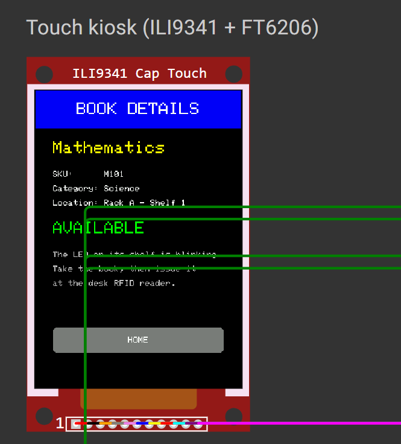
</p>

After selection, the system moves toward identifying and indicating the requested book.

---

# 📡 6. Feature 02 — RFID Identification

RFID provides the bridge between the **digital system** and the **physical book**.

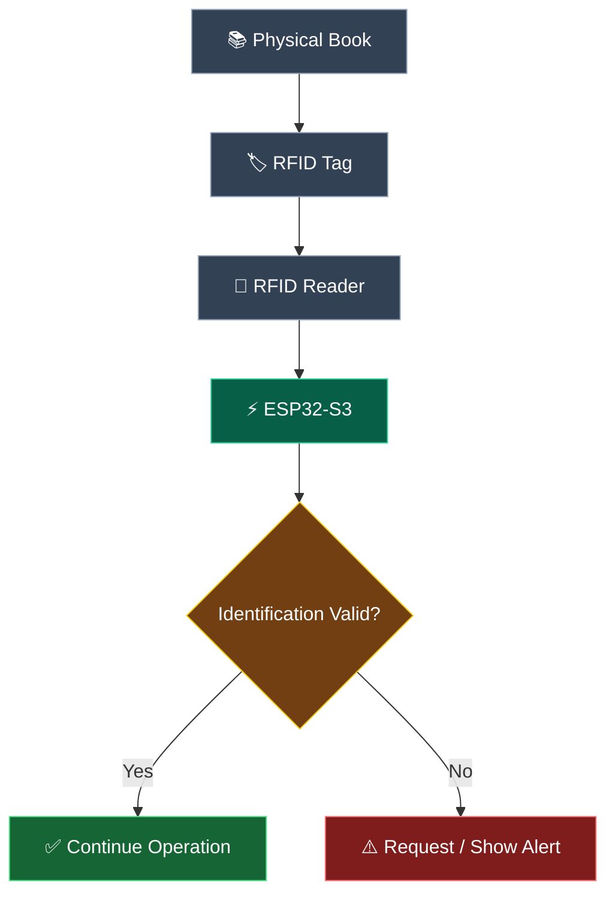

### Why RFID?

A book has a physical identity.

RFID allows that identity to be read electronically, giving the ESP32-S3 information that can be used by the library workflow.

### 📸 RFID Reader

<p align="center">
  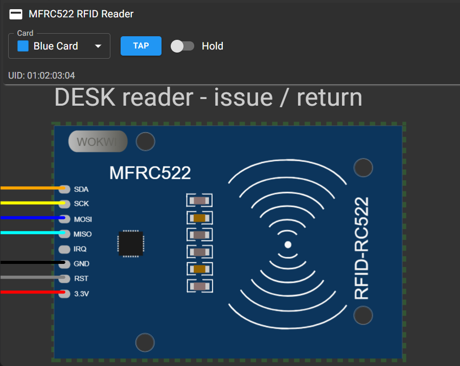
</p>

### 📸 Book Indication

<p align="center">
  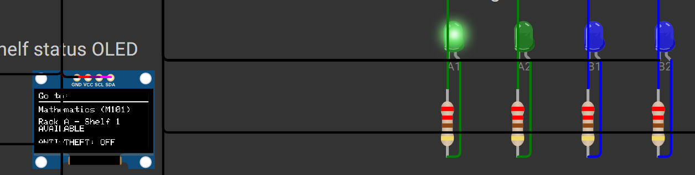
</p>

---

# 📖 7. Feature 03 — Issue a Book

The issue process can be understood as a simple decision flow.

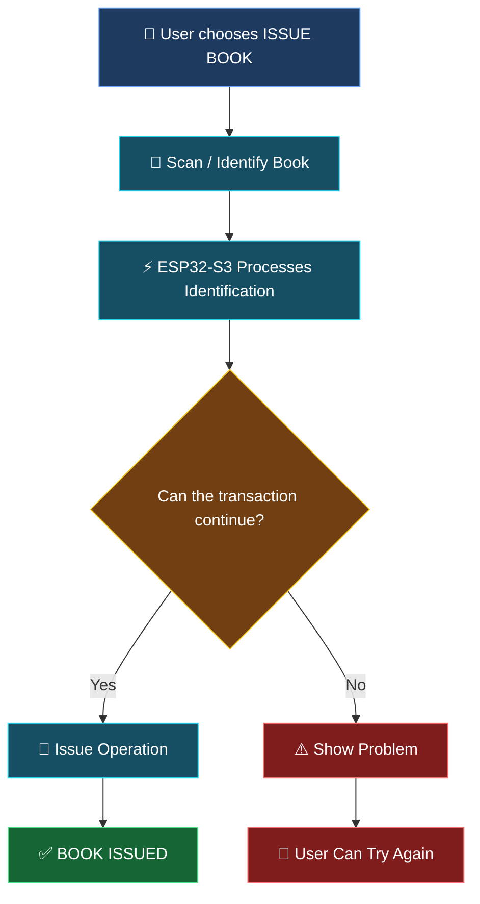

### 📸 Issue Screen

<p align="center">
  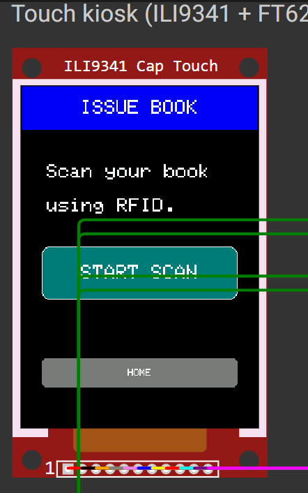
</p>

The interface clearly tells the user what to do next.

### 📸 Successful Issue

<p align="center">
  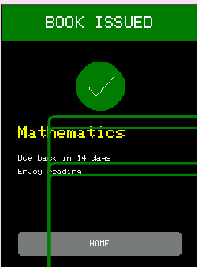
</p>

The success screen gives immediate confirmation.

---

# ↩️ 8. Feature 04 — Return a Book

The return workflow follows the same user-friendly principle.

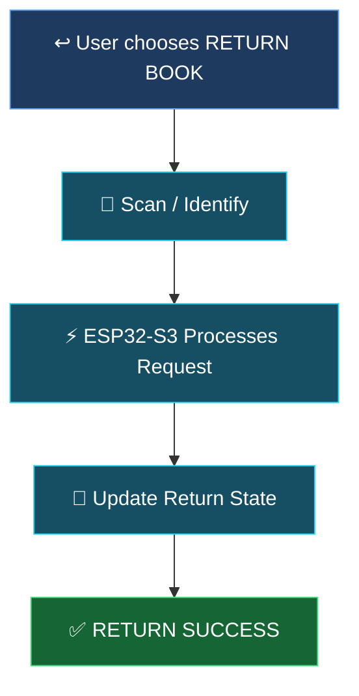

### 📸 Return Screen

<p align="center">
  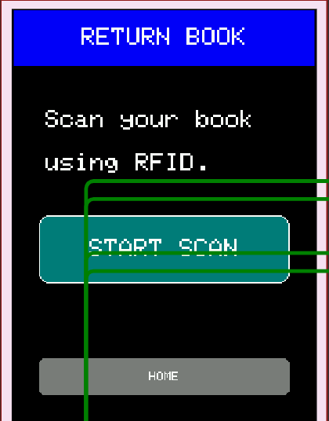
</p>

### 📸 Successful Return

<p align="center">
  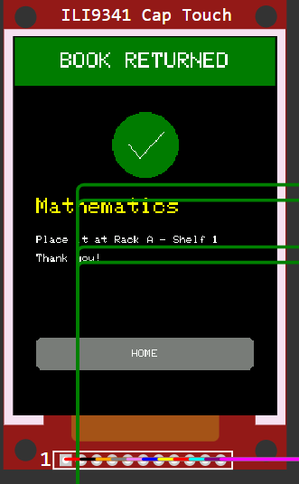
</p>

The interface gives the user a clear completion state.

---

# 💡 9. Feature 05 — Visual Feedback

A good embedded system should not make the user guess what happened.

Every important operation should end with a visible response.

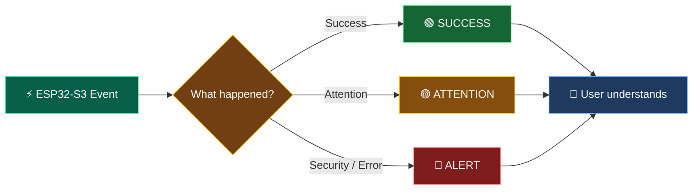

This creates a simple **machine → human communication loop**:

```text
EVENT
 ↓
PROCESS
 ↓
DECISION
 ↓
FEEDBACK
 ↓
USER KNOWS WHAT HAPPENED
```

### 📸 Hardware Demonstration

<p align="center">
  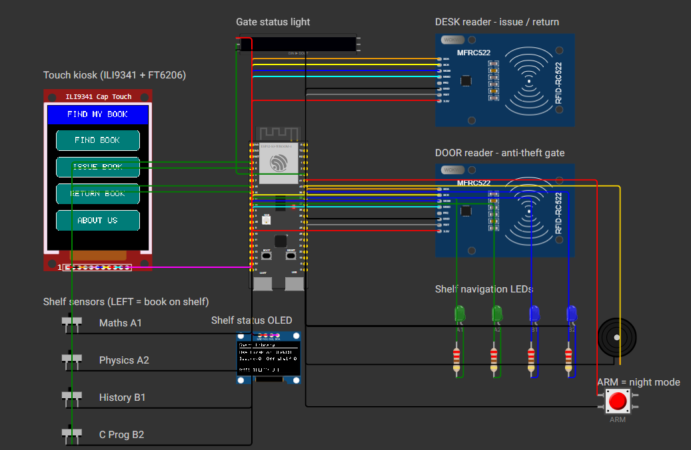
</p>

---

# 🚨 10. Feature 06 — Security-Oriented Detection

A smart library should also consider what happens when a book moves through a controlled area.

The prototype demonstrates an identification-based security concept:

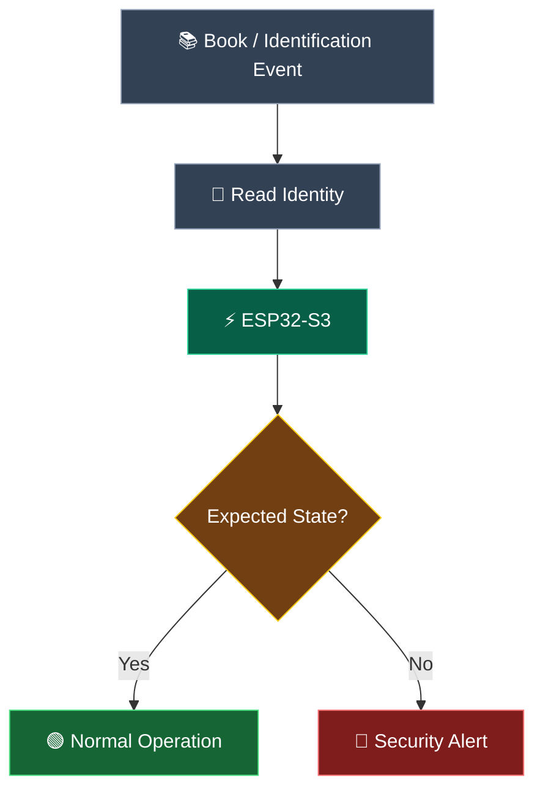

### 📸 Security Demonstration

<p align="center">
  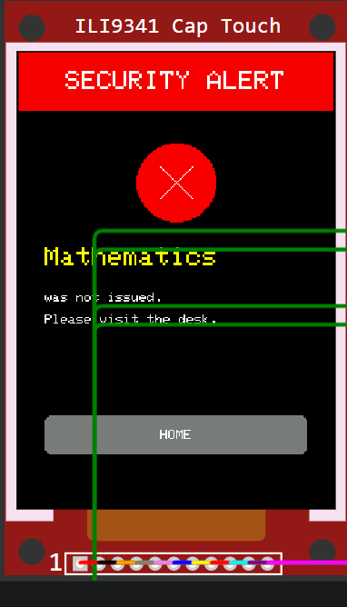
</p>

The prototype uses feedback to communicate when a security-related condition is detected.

---

# 🔄 11. One Complete User Journey

The easiest way to understand the project is to follow one user from start to finish.

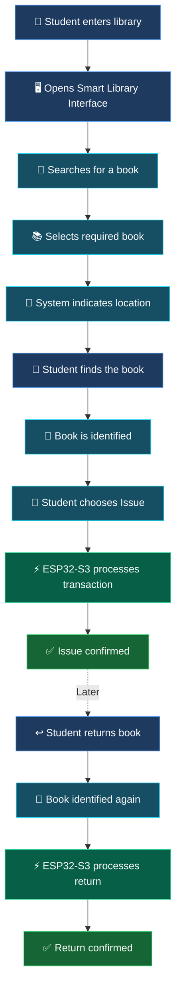

### In one sentence:

> **The ESP32-S3 receives the user's intention, performs the required library interaction, processes the physical identification and communicates the result back to the user.**

---

# 🧩 12. Hardware-to-Software Flow

The project is easier to understand if we separate the physical layer from the logic layer.

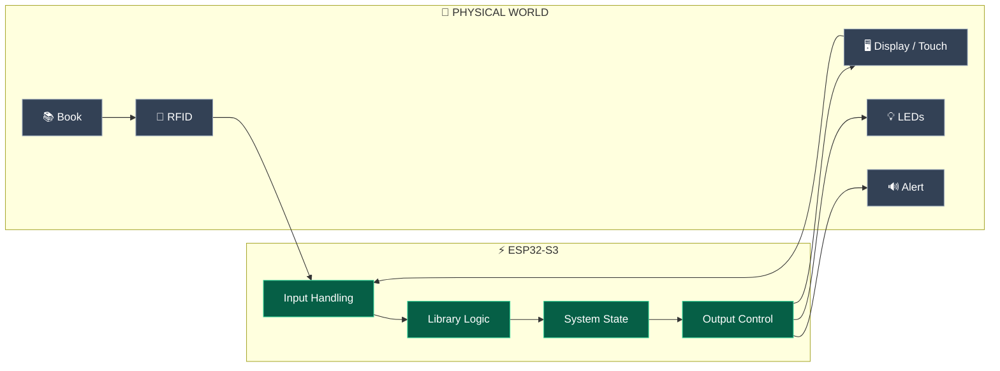

### This means:

**Input → Processing → Decision → Output**

That is the fundamental loop behind the prototype.

---

# ✨ 13. Interesting Design Features

### ⚡ Single-board architecture

The entire prototype is centered around **one ESP32-S3 board**.

### 🧠 Centralized control

Instead of spreading the main prototype logic across several controllers, the ESP32-S3 acts as the central decision point.

### 📡 Physical + digital interaction

The project connects:

```text
Digital interface
      ↕
ESP32-S3
      ↕
Physical book
      ↕
RFID
```

### 👤 User-first interaction

The system is designed around what the user needs to see and do, rather than around the electronics.

### 💡 Immediate feedback

Successful actions and alert conditions are communicated visually.

### 🧩 Modular thinking

Although the core is one board, the prototype can still be extended with additional peripherals.

---

# 🔧 14. Main Hardware & Technology

| Layer | Technology / Component |
|---|---|
| 🧠 Main Controller | **ESP32-S3** |
| 💻 Development | **VS Code + PlatformIO** |
| ⚙️ Firmware | **C/C++** |
| 📡 Identification | **MFRC522 RFID** |
| 🖥️ Interface | ESP32-S3 display/touch interface used in the prototype |
| 💡 Feedback | LEDs / display |
| 🚨 Alert | Alert output used by the prototype |
| 🧪 Simulation / Development | Wokwi where applicable |

---

# 📸 15. Prototype Gallery

## 🖥️ Smart Library Interaction

<p align="center">
  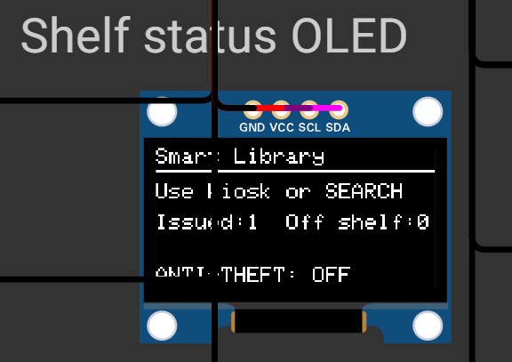
</p>

The default interface provides the starting point for the user's interaction with the system.

---

## 📡 RFID Scanner

<p align="center">
  
</p>

The RFID reader provides physical identification input to the system.

---

## 📖 Issue Workflow

<p align="center">
  
</p>

The interface guides the user through the issue operation.

<p align="center">
  
</p>

---

## ↩️ Return Workflow

<p align="center">
  
</p>

<p align="center">
  
</p>

---

# 📂 16. Repository Structure

```text
Smart-Library-Demo/
│
├── 📂 src/
│   └── main.cpp
│
├── 📂 photos_circuit/
│   ├── FindBook_demo.png
│   ├── after_selection_of_book.png
│   ├── RFID_scanner.png
│   ├── indication_of_book.png
│   ├── issue_book_demo.png
│   ├── issue_success.png
│   ├── return_book_demo.png
│   ├── return_success.png
│   ├── anti_theft_alarm.png
│   ├── circuit.png
│   └── default_OLED.png
│
├── 📄 platformio.ini
├── 📄 diagram.json
├── 📄 wokwi.toml
├── 📄 libraries.txt
├── 📄 smart-library.code-workspace
├── 📄 .gitignore
└── 📄 README.md
```

---

# 🚀 17. Getting Started

### Clone

```bash
git clone https://github.com/hemachandramenni07/Smart-Library-Demo.git
```

### Open

Open the project folder in **Visual Studio Code**.

### Install

Install the **PlatformIO IDE** extension.

### Build

```bash
pio run
```

### Upload

```bash
pio run --target upload
```

> Check `platformio.ini` for the board and environment configuration used by the current prototype.

---

# 👥 Team & Contributions

This project was developed collaboratively by our team.  
Rather than dividing the project into fixed individual roles, **all team members contributed across the different stages of the project**, including ideation, hardware, software, testing, debugging, documentation and final integration.

## 🤝 Equal Contribution

```text
                    📚 SMART LIBRARY
                          │
             ┌────────────┼────────────┐
             │            │            │
             ▼            ▼            ▼
          💡 IDEATION   🔧 HARDWARE   💻 SOFTWARE
             │            │            │
             └────────────┼────────────┘
                          │
                          ▼
                    🧪 TESTING
                          │
                          ▼
                    🐛 DEBUGGING
                          │
                          ▼
                    📖 DOCUMENTATION
                          │
                          ▼
                    🚀 FINAL DEMO
```

Every member participated in multiple stages of the development process, and the final prototype represents the **combined work and ideas of the entire team**.

## 👨‍👩‍👧‍👦 Our Team

| Team Member |
|:---:|
| **HemaChandra** |
| **Yasaswini** |
| **Nisha** |
| **Srujitha** |

## 🛠️ Areas of Collective Contribution

| Area | Team Contribution |
|---|---|
| 💡 **Ideation** | Developing and refining the Smart Library concept |
| 🧩 **System Design** | Planning the ESP32-S3-centric architecture |
| 🔧 **Hardware** | Circuit design, component integration and testing |
| 💻 **Software** | Firmware development and system logic |
| 📡 **RFID** | Identification and transaction workflow |
| 🖥️ **User Interface** | Designing and testing the interaction flow |
| 🧪 **Testing** | Testing the complete prototype and individual functions |
| 🐛 **Debugging** | Identifying and resolving hardware/software issues |
| 📖 **Documentation** | README, diagrams, project documentation and presentation |
| 🚀 **Integration** | Combining all modules into the final working prototype |

> **🤝 Built together, tested together, and demonstrated together.**

## 🌟 Team Philosophy

> **No single member owns a single module — the project is a collective effort.**

Each team member contributed ideas, implementation, testing and problem-solving throughout the development of the prototype.


# 🏆 20. Project Status

## ✅ Completed Prototype Demo

This repository represents a **completed and demonstrated Smart Library prototype** using **one ESP32-S3 board as the central controller**.

### Demonstrated

```text
🟢 ESP32-S3 Core
       ↓
🟢 Interactive Interface
       ↓
🟢 Find Book
       ↓
🟢 RFID Identification
       ↓
🟢 Issue Book
       ↓
🟢 Return Book
       ↓
🟢 Visual Feedback
       ↓
🟢 Security-Oriented Demo
```

> ### ⚡ One Board. One Core. One Smart Library.

---

# 🔮 21. Future Possibilities

The prototype is complete, but the concept can be extended.

Possible future directions include:

- 🎙️ Voice-assisted book search
- 🤖 AI-assisted natural-language search
- 🗺️ Interactive library map
- 📱 Mobile companion application
- 📊 Inventory analytics
- 🔐 More advanced RFID security
- 🧠 Intelligent book recommendations
- 🌐 Optional network-based library integration
- ⚡ Further hardware simplification

These are **future possibilities**, not features claimed as part of the current completed demo.

---

# 📚 22. Inspiration & Original Implementation

The project was inspired by a reference smart-library concept that addresses book discovery, RFID-based transactions, shelf guidance and security. fileciteturn1file0L15-L26

The reference material describes a broader architecture involving multiple embedded platforms. fileciteturn1file0L5-L12

Our project takes a different implementation direction:

```text
REFERENCE PROBLEM
       ↓
OUR OWN THINKING
       ↓
SINGLE ESP32-S3
       ↓
PROTOTYPE DESIGN
       ↓
HARDWARE + SOFTWARE
       ↓
TESTING
       ↓
COMPLETED DEMO
```

The goal is to show how the **same problem space can be approached from a different engineering perspective**.

---

# 🎬 23. Demonstration

Add your final demonstration video here:

```text
▶️ Demo Video: [Add YouTube / Drive / Demo Link]
```

A short demonstration should ideally show:

```text
1. Start the system
        ↓
2. Find a book
        ↓
3. Show location / indication
        ↓
4. Scan / identify book
        ↓
5. Issue book
        ↓
6. Return book
        ↓
7. Demonstrate security feedback
```

---

<p align="center">

## 📚 Find it. Identify it. Issue it. Return it.

### ⚡ Powered by one ESP32-S3.

**Inspired by an idea. Reimagined by us. Built as a working prototype.**

</p>
