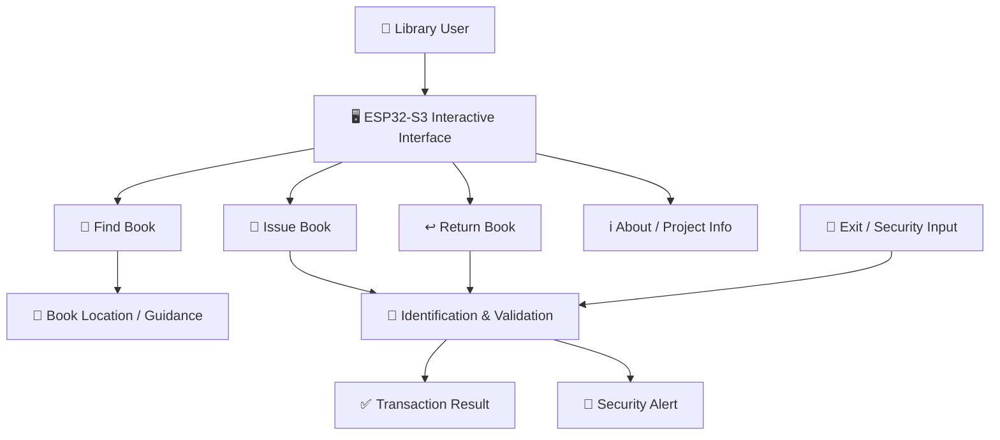

# 📚 Smart Library — ESP32-S3

<p align="center">
  
</p>

<p align="center">
  <b>A compact Smart Library concept reimagined around a single ESP32-S3 board.</b><br>
  Find books faster • Guide users visually • Simplify issue/return • Explore smarter library interaction
</p>

<p align="center">


</p>

---

## ✨ What is this?

**Smart Library** is an ESP32-S3-based library assistance concept created to address a simple problem:

> **A book may be available in a library, but finding its exact physical location can still take time.**

The project was **inspired by the smart-library problem and ideas presented in a reference article/document**, but the approach here is our own redesign. Instead of building a system around several controller boards, our goal is to explore how much of the interaction and intelligence can be brought together around **one ESP32-S3 board**.

The result is a compact, student-built prototype focused on making the library experience more interactive, guided and easier to use.

---

## 💡 From Inspiration → Our Idea

The reference concept describes a smart library that combines book discovery, RFID-based transactions, shelf guidance and security.

We took the **problem**, not the implementation, and asked:

> **"Can we rethink the same library experience around a single ESP32-S3?"**

### Reference idea

```text
Library problem
      ↓
Book search + identification
      ↓
Shelf navigation
      ↓
Issue / Return
      ↓
Security
```

### Our direction

```text
                 ┌─────────────────────┐
                 │      ESP32-S3       │
                 │   Central Control   │
                 └──────────┬──────────┘
                            │
          ┌─────────────────┼─────────────────┐
          ↓                 ↓                 ↓
     📚 Book Search     🔐 RFID Flow      💡 Guidance
          │                 │                 │
          └─────────────────┼─────────────────┘
                            ↓
                     🏛️ Smart Library
```

The important difference is the **architecture philosophy**: fewer controller boards, a compact central design, and an ESP32-S3 at the heart of the experience.

---

## 🎯 Problem We Are Solving

Traditional library systems can tell a student that a book is available without making the physical location immediately obvious.

That creates a familiar situation:

```text
"Book available" ✅
       ↓
"Where is it?" 🤔
       ↓
Walk through shelves 🔎
       ↓
Check rows manually 😓
       ↓
Finally find the book 📚
```

Our idea is to shorten that journey:

```text
Search
  ↓
Identify
  ↓
Guide
  ↓
Find
```

---

## 🚀 Core Concept

The ESP32-S3 acts as the central controller for the prototype.

The interaction is designed around four primary experiences:

| Feature | Purpose |
|---|---|
| 🔎 **Find Book** | Help the user locate a book |
| 📡 **Identify / Scan** | Use identification input such as RFID where required |
| 📖 **Issue / Return** | Support the library transaction flow |
| 🚨 **Security** | Provide an interaction path for detecting unauthorized movement |

The exact hardware/peripheral implementation can evolve as the project develops.

---

# 🧠 How the System Works

### 1️⃣ User Interaction

The user interacts with the ESP32-S3-based interface.

```text
        👤 USER
          │
          ▼
   ┌───────────────┐
   │   ESP32-S3    │
   │ Interactive UI│
   └───────┬───────┘
           │
     ┌─────┼─────┐
     ▼     ▼     ▼
   Find   Issue Return
   Book   Book   Book
```

### 2️⃣ Find a Book

A user searches for a book.

The system can present book information and guide the user toward the relevant physical location.

```text
Enter / Select Book
        ↓
   Book identified
        ↓
 Location displayed
        ↓
 Visual guidance
        ↓
   📚 Book found
```

### 3️⃣ Issue / Return

The transaction flow is designed around identification and confirmation.

```text
Scan / Identify
      ↓
Validate
      ↓
Confirm user + book
      ↓
Complete transaction
      ↓
Show result
```

### 4️⃣ Security

The same identification concept can be extended to monitor books at an exit point.

```text
Book detected
     ↓
Identification
     ↓
Check status
   ↙     ↘
Valid   Invalid
 ↓         ↓
Allow    Alert
```

---

# 🖥️ ESP32-S3-Centric Architecture



> **Design principle:** Keep the central control logic around the ESP32-S3 and add only the peripherals needed for the required interaction.

---

# 🔧 Hardware Direction

The redesigned concept is centered on:

### 🧠 Main Controller

- **ESP32-S3**
- Display/touch interaction where supported by the selected ESP32-S3 hardware
- GPIO-based peripheral control
- Wireless connectivity where required by the implementation

### 🔌 Possible Peripherals

Depending on the version of the prototype:

- RFID reader
- Addressable LEDs
- Buzzer
- Push buttons / switches
- Other sensors required by the experiment

> The goal of this repository is **not to reproduce the multi-board architecture from the reference concept**. It explores an ESP32-S3-centric implementation.

---

# 📸 Project Gallery

### 🔎 Find Book

<p align="center">
  
  
</p>

### 📡 RFID / Identification

<p align="center">
  
  
</p>

### 📖 Issue & Return

<p align="center">
  
  
</p>

<p align="center">
  
  
</p>

### 🚨 Security / Hardware

<p align="center">
  
  
</p>

---

# 🛠️ Technology Stack

| Layer | Technology |
|---|---|
| 🧠 Controller | **ESP32-S3** |
| 💻 Development | **VS Code + PlatformIO** |
| ⚙️ Firmware | **C/C++** |
| 🎨 UI | ESP32-S3 display/UI environment used by the prototype |
| 📡 Connectivity | ESP32-S3 wireless capabilities where required |
| 📚 Identification | RFID/peripheral interface where implemented |
| 💡 Feedback | LEDs / display / buzzer where implemented |
| 🧪 Simulation | Wokwi / PlatformIO-compatible workflow where applicable |

---

# 📁 Repository Structure

```text
Smart-Library-Demo/
│
├── 📂 src/
│   └── main.cpp
│
├── 📂 photos_circuit/
│   ├── circuit.png
│   ├── FindBook_demo.png
│   ├── RFID_scanner.png
│   ├── issue_book_demo.png
│   ├── issue_success.png
│   ├── return_book_demo.png
│   ├── return_success.png
│   └── ...
│
├── 📄 diagram.json
├── 📄 libraries.txt
├── 📄 platformio.ini
├── 📄 wokwi.toml
├── 📄 README.md
└── 📄 .gitignore
```

---

# ⚡ Getting Started

## 1. Clone the repository

```bash
git clone https://github.com/hemachandramenni07/Smart-Library-Demo.git
```

```bash
cd Smart-Library-Demo
```

## 2. Open in VS Code

Open the project folder in **Visual Studio Code**.

Make sure the **PlatformIO extension** is installed.

## 3. Connect the ESP32-S3

Connect the board through USB and select the correct PlatformIO environment/port for your hardware.

## 4. Build

From the PlatformIO interface:

```text
Build
```

or use:

```bash
pio run
```

## 5. Upload

Use PlatformIO:

```text
Upload
```

or:

```bash
pio run --target upload
```

> Check `platformio.ini` for the exact board and environment configuration used by this repository.

---

# 🧪 Development Workflow

We are using GitHub as a collaborative workspace.

```text
                 ┌─────────────┐
                 │    main     │
                 │ Stable Code │
                 └──────┬──────┘
                        │
       ┌────────────────┼────────────────┐
       ↓                ↓                ↓
 feature/esp32     feature/rfid     feature/...
       │                │                │
       └────────────────┼────────────────┘
                        ↓
                 Pull Request
                        ↓
                      main
```

### Create a feature branch

```bash
git checkout main
git pull origin main
git checkout -b feature/your-feature
```

### Commit your changes

```bash
git add .
git commit -m "Describe your change"
```

### Push the branch

```bash
git push -u origin feature/your-feature
```

Then create a **Pull Request** on GitHub.

---

# 👥 Team

| Role | Responsibility |
|---|---|
| 👨‍💻 **Hema** | ESP32-S3 integration & project coordination |
| 👩‍💻 **Nisha** | RFID / identification module |
| 👩‍💻 **Srujitha** | Hardware / visual guidance experimentation |
| 👩‍💻 **Yasaswini** | Backend / documentation / integration |

> Responsibilities may evolve as the prototype develops.

---

# 🌱 Why ESP32-S3?

The ESP32-S3 gives us a useful combination of:

- 🧠 capable microcontroller
- 📡 wireless connectivity
- 🖥️ display-oriented capabilities
- 🔌 multiple GPIO interfaces
- ⚡ compact embedded platform
- 🧩 support for a wide range of peripherals
- 🤖 room for future intelligent/AI-assisted features

The motivation behind the redesign is to explore how much functionality can be concentrated into a **single capable embedded platform**, rather than beginning with a collection of separate controller boards.

---

# 🔮 Future Scope

The project can evolve in several directions:

- 🎙️ Voice-assisted book search
- 🤖 AI-assisted natural-language book search
- 🗺️ Interactive shelf/map navigation
- 📱 Mobile companion interface
- 🔐 Improved RFID-based security
- 📊 Local inventory analytics
- 🧠 Smarter book recommendations
- 🏷️ Better physical book identification
- 🌐 Optional networked library integration
- ♻️ Lower-cost and lower-power hardware design

---

# 📚 Inspiration & Originality

This project was **inspired by the smart-library problem and architecture described in a reference article/document**.

The reference concept explored a larger system involving an ESP32-S3 kiosk, separate shelf controllers, RFID handling and a Raspberry Pi backend. fileciteturn1file0L5-L12

Our project takes the underlying **problem statement and inspiration** and explores it from our own engineering perspective:

> **Can a smart-library experience be redesigned around one ESP32-S3 instead of depending on multiple controller boards?**

The project therefore focuses on **re-thinking, simplifying and experimenting**, rather than reproducing the reference implementation.

---

# ⚠️ Project Status

🚧 **Prototype / Academic Project**

This repository is an ongoing engineering project. Hardware connections, software architecture and features may change as the team experiments with different implementations.

Some features shown in the project gallery represent the broader smart-library concept and prototype workflow; the exact feature set of the current ESP32-S3-only implementation should be checked against the latest source code.

---

# 📜 Reference

The project concept was inspired by a reference smart-library document describing book search, RFID-based issue/return, shelf guidance and security workflows. fileciteturn1file0L15-L26

**Reference concept:** *Find My Book – AI & IoT Smart Library Navigation & Inventory*

---

# ⭐ If you find this project interesting

Give the repository a ⭐ and follow the development as we continue experimenting with an **ESP32-S3-first Smart Library**.

<p align="center">

### 📚 Search smarter.  
### 💡 Navigate easier.  
### ⚡ Build smaller.  
### 🧠 Think beyond the reference.

</p>

---

<p align="center">
  <b>Built with curiosity, embedded systems, and a lot of debugging. 🚀</b>
</p>
